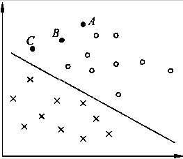
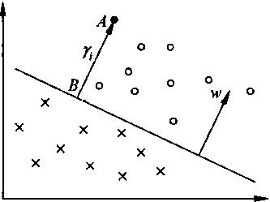
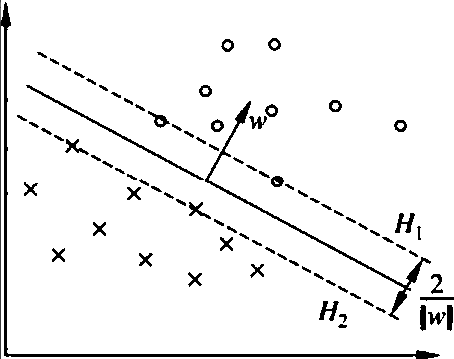

# 支持向量机 support vector machine SVM

## 线性可分 支持向量机
线性可分支持向量机 假设这两个空间的元素一一对应，并将输入空间的输入映射为特征空间中的特征向量
非线性支持向量机 利用一个从输入空间到特征空间的非线性映射将输入映射为特征向量

支持向量机的学习都是在特征空间进行的
假设给定一个特征空间上的训练数据集
$$T=\{(x_1,y_1),(x_2,y_2),\cdots,(x_N,y_N)\}$$

其中, $X_i\in X=R^n$, $y_i\in y=\{+1,-1\}$, $i=1,2, \ldots ,N$, $X_i$为第$i$个特征向量，也称实例，$y_i$为$x_i$的类标记,
当$y_i=+1$时，称$x_i$为正例; 
当$y_i=-1$时，称$x_i$为负例; 
$(x_i,y_i)$为样本点,再假设训练数据集是线性可分的

学习的目标是在特征空间中找到一个分离超平面,能将实例分到不同的类
分离超平面对应于方程 $w\cdot x +b = 0$, 它由法向量$w$和截距$b$决定,可以用$(w,b)$来表示
分离平面将特征空间划分为两部分，一部分是正类(法向量指向的一侧)，一部分是负类

定义7.1 (线性可分支持向量机) 给定线性可分训练数据集，通过间隔最大化或等价地求解相应的凸二次规划问题学习得到的分离超平面为
$$w^*\cdot x + b^* = 0$$
以及相应的分类决策函数
$$f(x) = sign(w^* \cdot x +b^*)$$
称为线性可分支持向量机

### 函数间隔和几何间隔

在图中，有$A,B,C$三个点，表示三个实例，均在分离超平面的正类一侧，预测分类
点 $A$ 距分离超平面较远，若预测该点为正类，就比较确信预测是正确的；
点 $C$ 距分离超平面较近，若预测该点为正类就不那么可信;
点 $B$ 介于点 $A$ 与 $C$ 之间，预测其为正类的确信度也在 $A$ 和 $C$ 之间

一般来说，一个点距离分离超平面的远近可以表示分类预测的确信程度
在超平面确定的情况下，$|w\cdot x+b|$能够相对地表示点$x$距离超平面的远近
ji而 $w\cdot x +b$ 的符号与类标记 $y$ 的符号是否一致能够表示分类是否正确
所以用 $y(w\cdot x+b)$ 来表示分类的正确性及确信度，这就是函数间隔(functional margin)的概念

定义7.2 (函数间隔) 对于给定的训练数据集$T$和超平面$(w,b)$, 定义超平面$(w,b)$关于样本点(x_i,y_i)的函数间隔为
$$\gamma_i = y_i(w\cdot x_i +b)$$
定义超平面$(w,b)$关于训练数据集$T$的函数间隔为超平面(w,b)关于$T$中所有样本点$(x_i,y_i)$的函数间隔之最小值,即
$$\gamma = min_{i=1,\cdots,N } \gamma_i$$

函数间隔可以表示分类预测的正确性及置信度。但是选择分离超越平面时，只有函数间隔还不够，
因为只要成比例地改变$w$和$b$, 例如将他们改为$2w$和$2b$,超平面并没有改变,但是函数的间隔却成为了原来的2倍
我们可以对分类超平面的法向量$w$加些约束,如归一化 $||w|| = 1$使得间隔是确定的
这时函数间隔成为几何间隔 (genometric margin)

上图给出超平面$(w,b)$及其法向量$w$. 点$A$表示某一实例$x_i$, 其类标记为 $y_i = +1$
点$A$与超平面$(w,b)$的距离由线段$AB$给出，记作 $\gamma_i$
$$\gamma_i = \frac w{||w||}\cdot x_i + \frac b{||w||}$$
其中, ||w||为$w$的$L_2$范数,这时点$A$在超平面正的一侧的情形
如果点$A$在超平面负的一侧，即$y_i = -1$,那么点与超平面的距离为
$$\gamma_i =-( \frac w{||w||}\cdot x_i + \frac b{||w||} )$$

定义超平面$(w,b)$关于训练数据集$T$的几何间隔为超平面(w,b)关于$T$中所有样本点(x_i,y_i)的几何间隔之最小值，即
$$\gamma = min_{i=1,\cdots,N}\gamma_i$$

### 7.1.3 间隔最大化
支持向量机学习的基本思想是求解能够正确划分训练数据集并且几何间隔最大的分离超平面
对线性可分的训练数据集而言，线性可分分离超平面有无穷多个，但是几何间隔最大的分离超平面是唯一的
这里的间隔最大化又称为硬间隔最大化
#### 1. 最大间隔分离超平面
如何求一个几何间隔最大的分离超平面
这个问题可以表示为下面的约束最优化问题

$max_{w,b} \gamma$

$y_i(\frac w{||w||}\cdot x_i + \frac b{||w||}) \ge \gamma, i=1,2,\cdots,N$

等价于求二次规划(convex quadratic programming)问题
$min_{w,b}$    $\frac12||w||^2$
$y_i(w\cdot x_i+b)-1 \ge 0, i=1,2,\cdots,N$
这是一个凸二次规划问题，凸优化问题是指约束最优化问题
$min_w f(w)$
$g_i(w) \le 0, i=1,2,\cdots,k$
$g_i(w) = 0, i=1,2,\cdots,l$
其中，目标函数f(w)和约束函数$g_i(w)$都是$R^n$上的连续可微的凸函数, 约束函数$h_i(w)$是 $R^n$ 上的仿射函数
当目标函数f(w)是二次函数且约束函数$g_i(w)$是仿射函数时，上述凸最优化问题成为凸二次规划问题

3 . 支持向量和间隔边界
在线性可分的情况下，训练数据集的样本点与分离超平面距离最近的样本点的实例称为支持向量。
支持向量是约束条件等号成立的点，即
$$y_i(w\cdot x_i +b) -1 = 0$$

对$y_i = +1$的正例的点，支持向量在超平面
$$H_1 : w\cdot x +b = 1$$
上

对$y_i = -1$的负例的点，支持向量在超平面
$$H_1 : w\cdot x +b = -1$$
上

如下图所示， 在$H_1$和$H_2$上的点就是支持向量

$H_1$与$H_2$之间的距离称为间隔(margin),间隔依赖与分离超平面的法向量$w$,等于$\frac2{||w||}$
$H_1$和$H_2$称为间隔边界

